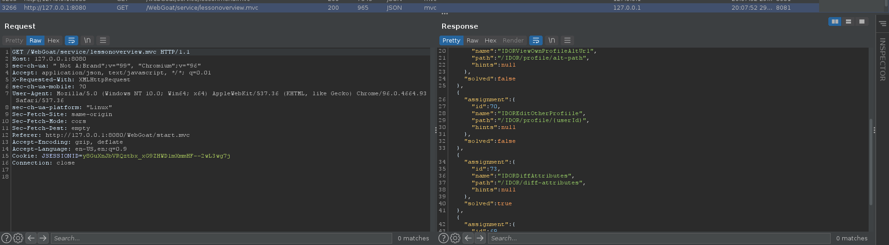
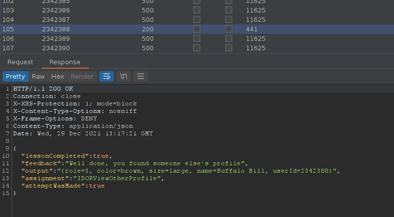
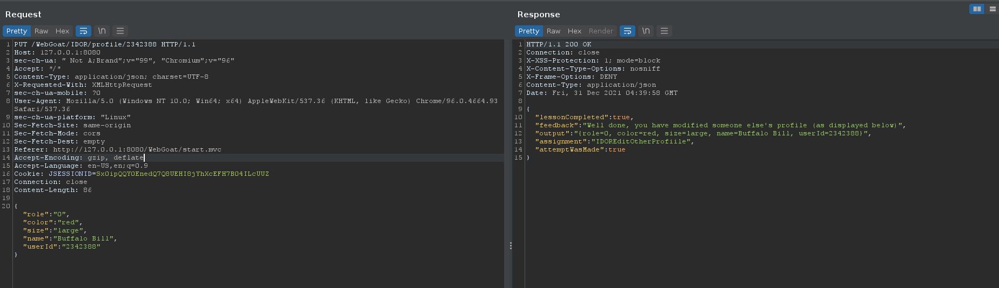
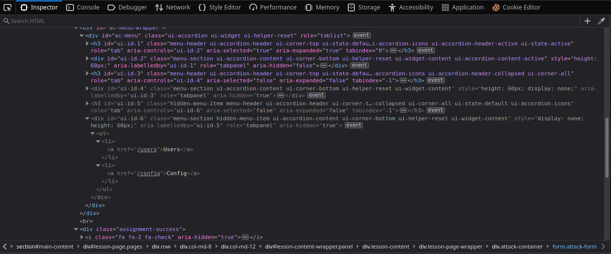
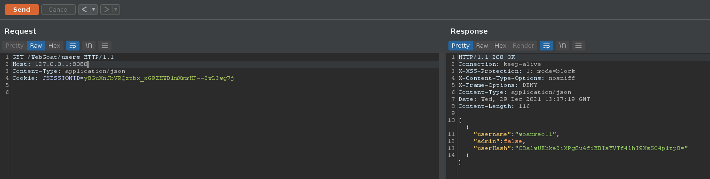

# (A5) Broken Access Control

## Insecure Direct Object References

### 3 Observing Differences & Behaviors

Dùng burpsuite và bắt được 2 thuộc tính không hiện ra là `role` và `userid`:

```json
{
  "role" : 3,
  "color" : "yellow",
  "size" : "small",
  "name" : "Tom Cat",
  "userId" : "2342384"
}
```

### 4 Guessing & Predicting Patterns

Check request của file `lessonoverview.mvc` thì mình tìm được path:

```
"path" : "/IDOR/profile/{userId}",
```




Lấy `userid` từ câu 3 rồi dán vào url là xong.

```
/WebGoat/IDOR/profile/2342384
```

### 5. Playing with the Patterns

Dùng burpsuite để bruteforce `userid` với url từ câu 4 và tìm được 1 user có id `2342388`.



Tiếp theo là chỉnh sửa profile, mình copy lại đoạn `output` response bên trên và sửa `role`, `color` và chỉnh lại thành `json` sau đó dùng `PUT` method để request lại. Chú ý `Content-Type: application/json`.



## Missing Function Level Access Control

### 2. Relying on Obscurity

Inspect element và mình tìm thấy 2 thuộc tính bị ẩn là `Users` và `Config`



### 3. Just Try It

Tạo 1 request đến `/WebGoat/users` vừa tìm được ở câu 2 và đổi lại header về `Content-Type: application/json`.

