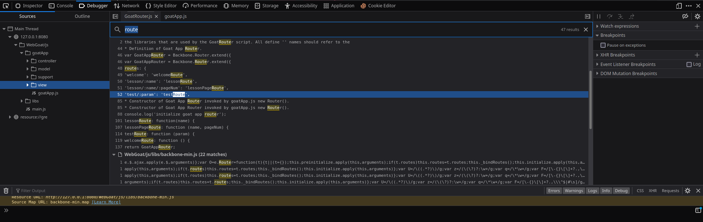
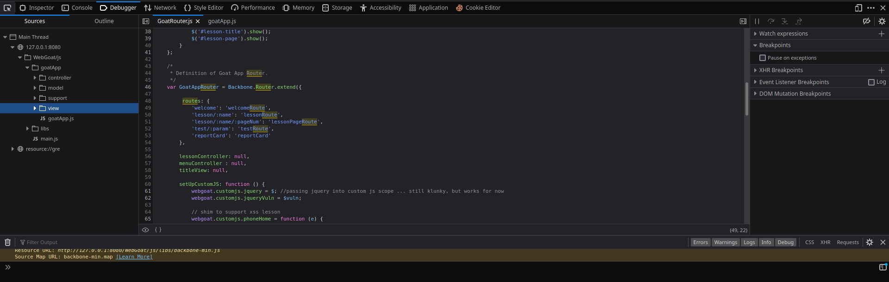
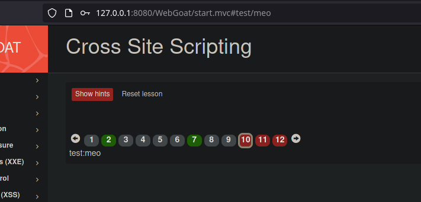
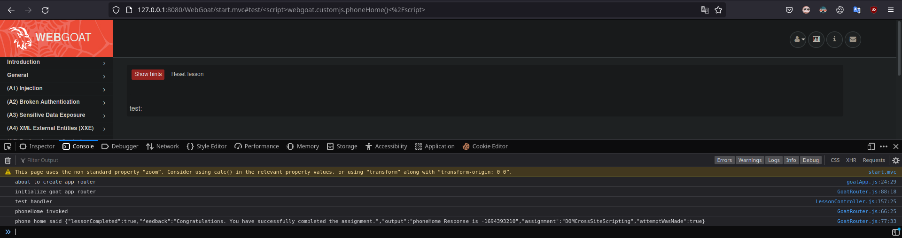

# (A7) Cross-Site Scripting (XSS)

## Cross Site Scripting

### 7. Try It! Reflected XSS

Inject vào ô credit card number:

```html
<script>alert(1)</script>
```

### 10. Identify potential for DOM-Based XSS

Bấm `F12` và vào phần `Debugger` sau đó bấm `Ctrl + Shift + F` và tìm từ khóa `route`. Mình bắt gặp đươc một đoạn `test/:param` có từ khóa `test` trong yêu cầu.



Bấm vào thì mình nhận ra đây chính là phần xử lí route vì có route `lession` trong:



Route này sẽ in ra param mình nhập vào:



Vậy đây chính là route cần tìm.

```
start.mvc#test/
```

### 11. Try It! DOM-Based XSS

Mở `Console` lên để xem output và inject xss vào route vừa tìm ở câu trước, cần url encode trước khi dán vào thanh địa chỉ.

Trigger function bằng thẻ `script`:

```
<script>webgoat.customjs.phoneHome()</script>
```



Submit số `phoneHome Response` vừa xuất hiện là xong.