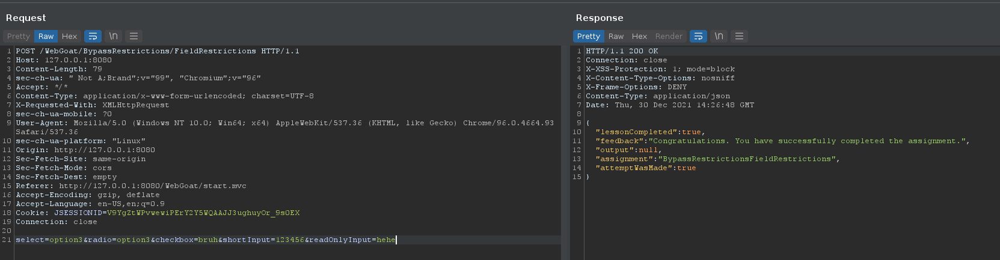
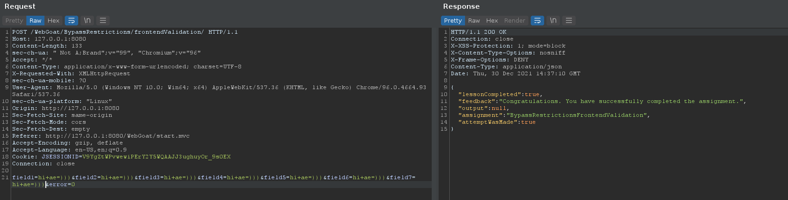
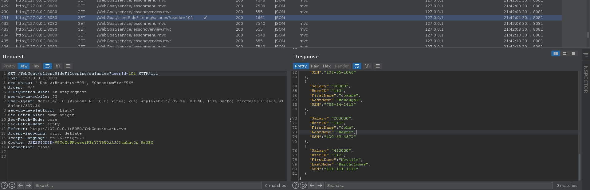
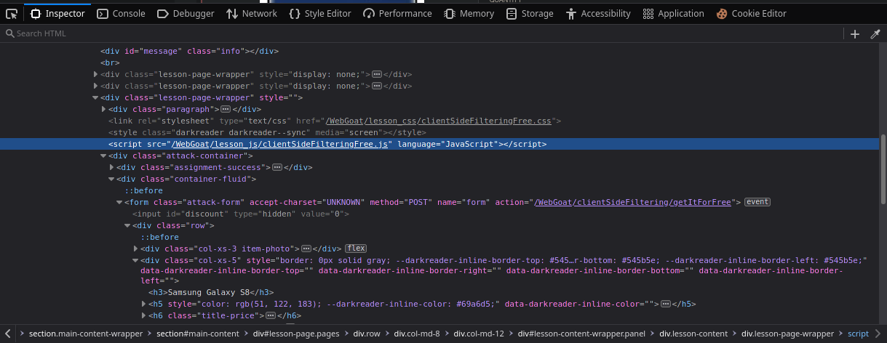
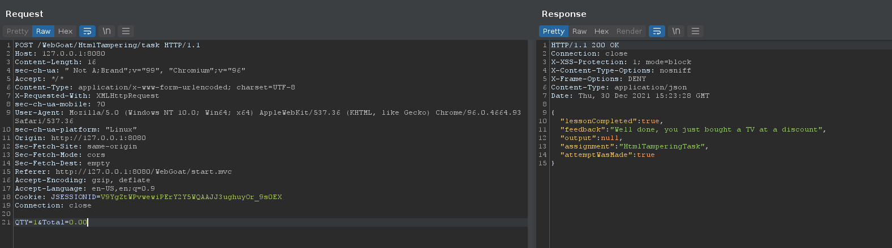

# Client side

## Bypass front-end restrictions

### 2. Field Restrictions

Dùng burpsuite bắt request và sửa tùy ý.



### 3. Validation

Tiếp tục dùng burpsuite để bắt request và sửa.




## Client side filtering

### 2. Salary manager

Check `HTTP history` của burpsuite dẫn mình đến toàn bộ thông tin được gửi về. Tìm lương của `Neville Bartholomew` và submit là xong.



### 3

View source thì mình tìm thấy file `clientSideFilteringFree.js` có vẻ liên quan:



Check thử file thì trong đó có 1 function như này:

```js
$(".checkoutCode").on("blur", function () {
    var checkoutCode = $(".checkoutCode").val();
    $.get("clientSideFiltering/challenge-store/coupons/" + checkoutCode, function (result, status) {
        var discount = result.discount;
        if (discount > 0) {
            $('#discount').text(discount);
            calculate();
        } else {
            $('#discount').text(0);
            calculate();
        }
    });
})
```

Mình thử path `http://127.0.0.1:8080/WebGoat/clientSideFiltering/challenge-store/coupons/` thì tìm được code:

```json
{
  "codes" : [ {
    "code" : "webgoat",
    "discount" : 25
  }, {
    "code" : "owasp",
    "discount" : 25
  }, {
    "code" : "owasp-webgoat",
    "discount" : 50
  }, {
    "code" : "get_it_for_free",
    "discount" : 100
  } ]
}
```

Dán code `get_it_for_free` vào và submit là xong.

## HTML tampering

### 2. Try it yourself

Sửa param `Total` về `0.00` là xong :D

